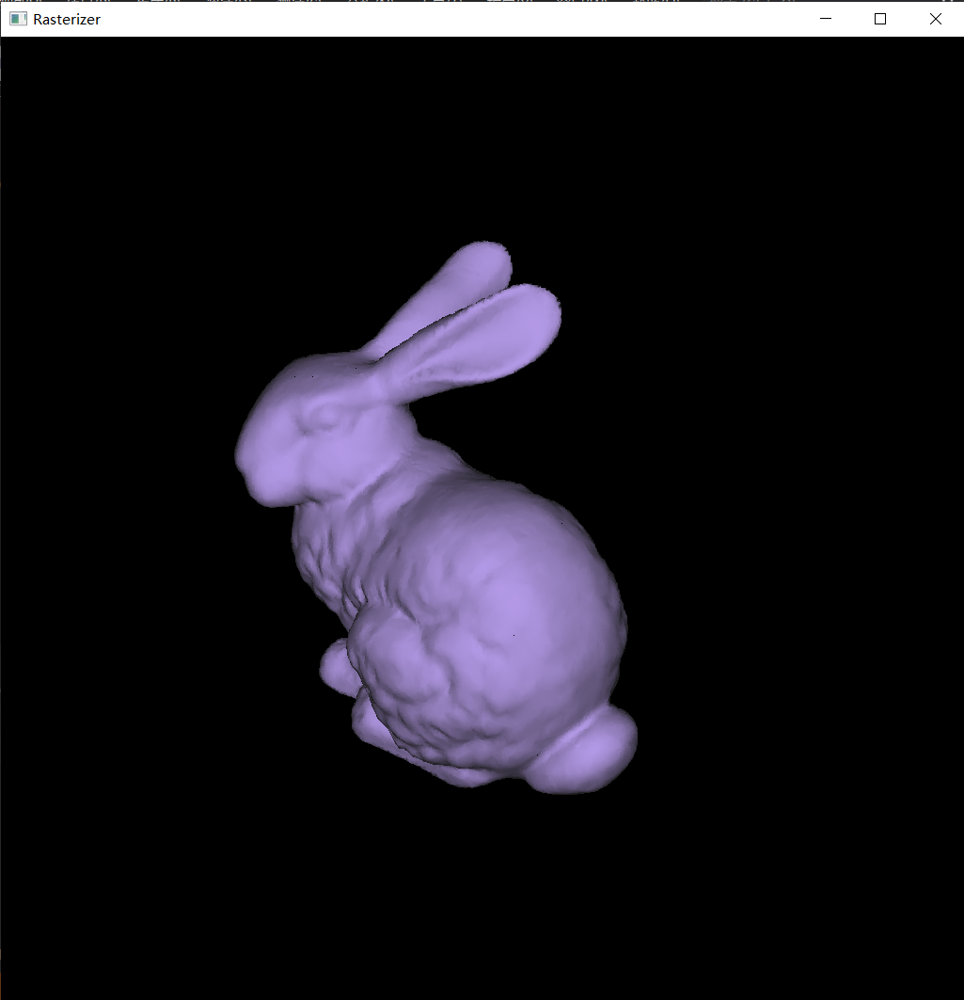
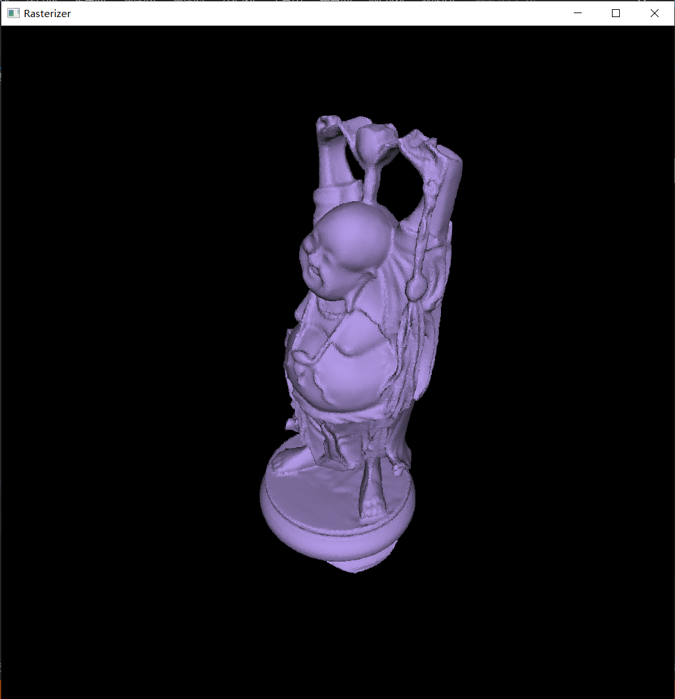
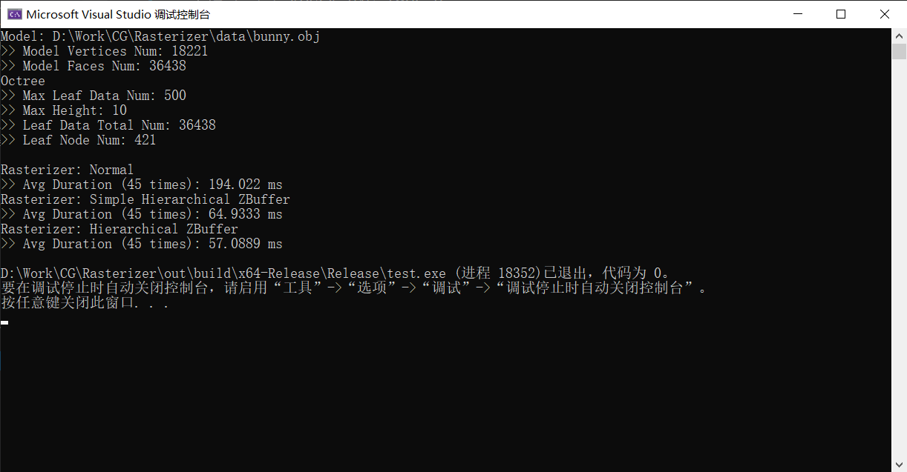
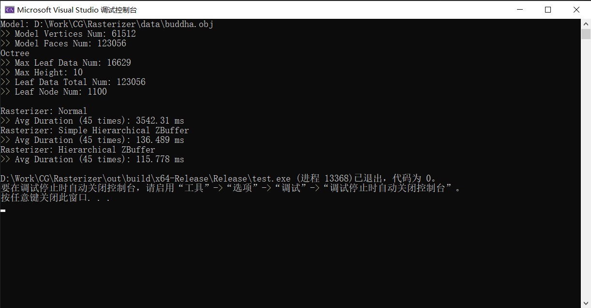

# 作业报告

[toc]

## 开发环境

- 使用 `CMake` 组织 `C++` 项目
- 使用 `Visual Studio 2019` 进行开发，编译器为 `MSVC 16.11.5`

## 使用说明

- 使用支持CMake项目的IDE打开项目
- 项目中包含两个可执行文件，一个库：
  - demo (exe)
  - test (exe)
  - rasterizer (lib)
- 使用IDE编译并生成该项目

### demo

- `demo` 可执行文件用于展示绘制效果，包含以下输入参数：
  - `<-m / --model <导入OBJ模型的路径>>`
  - `[-r / --rasterizer <0/1/2>]`，默认为 `-r 1`
    - 0: 使用普通的扫描线ZBuffer绘制器
    - 1: 使用带松散八叉树的层级扫描线ZBuffer绘制器（完整版）
    - 2: 使用简单版本的层级扫描线ZBuffer绘制器
- 运行后，使用键盘 `上下左右键` 让相机环绕模型，使用 `Q / E 键`拉远、拉近 相机

### test

- `test` 可执行文件用于对比多个绘制器的性能，包含以下输入参数：
  - `<-m / --model <导入OBJ模型的路径>>`
  - `[-t / --test-time <每个绘制器绘制的帧数>]`，默认为 `-t 45`
- 无交互操作

## 主要类

### 库rasterizer的接口类

```cpp
class Rasterizer {};
class ZBufferRasterizer : virtual public Rasterizer {};
class SimpleHZBufferRasterizer : virtual public Rasterizer {};
class HierarchicalZBufferRasterizer : virtual public Rasterizer {};
```

### 库rasterizer内部实现的类

```cpp
// 主要实现光栅化前的工作，包括坐标变换、面剔除、透视裁剪等
class RasterizerImpl : virtual public Rasterizer {};
// 实现普通的扫描线ZBuffer绘制器
class ZBufferRasterizerImpl : public RasterizerImpl, public ZBufferRasterizer {};
// 实现层级扫描线ZBuffer绘制器（简易版）
class SimpleHZBufferRasterizerImpl : public RasterizerImpl,
                                     public SimpleHZBufferRasterizer {};
// 实现层级扫描线ZBuffer绘制器（完整版）
class HierarchicalZBufferRasterizerImpl : public SimpleHZBufferRasterizerImpl,
                                          public HierarchicalZBufferRasterizer {};
```

## 主要数据结构

### RasterizerImpl::V2R

顶点处理阶段（坐标变换、面剔除、透视裁剪）向光栅化阶段传递的中间数据结构。每个三角面产生一个 `V2R` 结构。各字段含义如下：

```cpp
struct RasterizerImpl::V2RDat {
    glm::vec4 pos; // 屏幕空间的位置、透视变换后的深度、透视校正使用的w
    glm::vec4 norm, wdPos; // 法线、世界空间的位置，用于计算光照
    union SurfDat {
        glm::vec2 uv; // 顶点纹理坐标（可选）
        glm::vec3 col; // 顶点颜色（可选）
    } surf;
};
struct RasterizerImpl::V2R {
    uint8_t vCnt; // 面片内顶点数（<=9）
    std::array<V2RDat, 9> vs; // 面片内顶点数组。容量为9，因为一个三角面经过透视裁剪，最多产生9个顶点
};
```

### ZBufferRasterizerImpl::EdgeNode

`普通扫描线ZBuffer绘制器` 中表示边的数据结构。各字段含义如下：

```cpp
struct ZBufferRasterizerImpl::EdgeNode {
    std::array<uint8_t, 2> v2; // 从属面片的顶点编号，取值范围为[0,8]
    size_t tIdx; // 从属面片的编号
    glm::uint ymax; // 该边在屏幕空间的最大y值
    float x; // 该边当前在屏幕空间的x值
    float dx; // 该边在屏幕空间中x轴上，单位y变化引起的x变化值
    float coeff; // 当前位置对应的百分比（x/(xmax-xmin) 或 y/(ymax-ymin)）
    float dcoeff; // 类似dx之于x

    bool operator<(const EdgeNode &other) const {
        return x < other.x || (x == other.x && dx < other.dx);
    }
};
```

### SimpleHZBufferRasterizerImpl::EdgeNode

`层次ZBuffer绘制器`（包括简单版和完整版）中表示边的数据结构。各字段含义与 `ZBufferRasterizerImpl::EdgeNode` 相同，但由于 `层次ZBuffer绘制器` 每次仅光栅化一个三角面片，故不需要记录 `从属面片的编号` 字段。

```cpp
struct SimpleHZBufferRasterizerImpl::EdgeNode {
    std::array<uint8_t, 2> v2;
    // size_t tIdx is NOT needed
    glm::uint ymax;
    float x;
    float dx;
    float coeff;
    float dcoeff;

    bool operator<(const EdgeNode &other) const {
        return x < other.x || (x == other.x && dx < other.dx);
    }
};
```

### 其他数据结构

```cpp
class SimpleHZBufferRasterizerImpl : public RasterizerImpl,
                                     public SimpleHZBufferRasterizer {
  protected:
    // 层级ZBuffer相关的数据结构 {
    static constexpr uint8_t Z_BUF_MIPMAP_LVL_NUM = 6;
    std::array<glm::uvec2, Z_BUF_MIPMAP_LVL_NUM> rndrSzMipmap;
    std::array<size_t, Z_BUF_MIPMAP_LVL_NUM> resolutionMipmap;
    std::array<std::vector<float>, Z_BUF_MIPMAP_LVL_NUM> zbufferMipmap;
    // }

  private:
    // 利用时序一致性的数据结构 {
    std::unordered_set<glm::uint> activeFaceIndices;
    std::unordered_set<glm::uint> tmpAFIs;
    // }
};

class HierarchicalZBufferRasterizerImpl : public SimpleHZBufferRasterizerImpl,
                                          public HierarchicalZBufferRasterizer {
  private:
    // 八叉树相关的数据结构 {
    Octree<glm::uint, 512, 10> otree;
    std::stack<decltype(otree)::Node *> stk;
    // }
    // 利用时序一致性的数据结构 {
    std::unordered_set<decltype(otree)::Node *> activeLeafNodes;
    std::unordered_set<decltype(otree)::Node *> tmpALNs;
    // }
};
```

## 实验结果

### 实验条件

- 使用模型：
  - bunny.obj （面数为36438，顶点数为18221）
  - buddha.obj （面数为123056，顶点数为61512）
- 使用 `MSVC` 的默认 `Release` 配置生成测试用可执行程序

### 绘制效果对比

||普通|层级（简易）|层级（完整）|
|---|---|---|---|
|bunny||||
|buddha||||

### 绘制效率对比

||bunny|buddha|
|---|---|---|
|有背面剔除|||
|无背面剔除|||

### 结论

- 三个绘制器绘制效果一致。在绘制效率上，普通版本最慢，层级版本有较大提升，其中完整版（使用松散八叉树索引面片）较简易版有小幅提升。
- 使用背面剔除，对于以上两个比较简单的模型，减少了重叠的面片数量，削弱了层级版本的提速效果。
